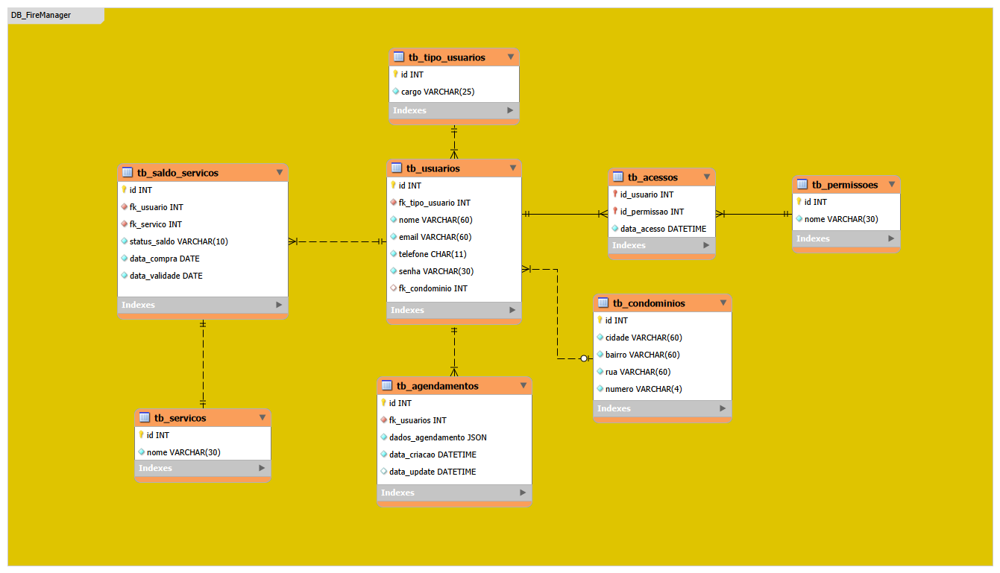

# DataBase Script MySQL - FireManager

Sabemos que não é uma boa prática expormos a estrutura de armazenamento de dados de um projeto por motivos de segurança. 
Embora isso seja um projeto acadêmico, queremos seguir as boas práticas de desenvolvimento seguro, portanto, este repositório está com visibilidade privada.

